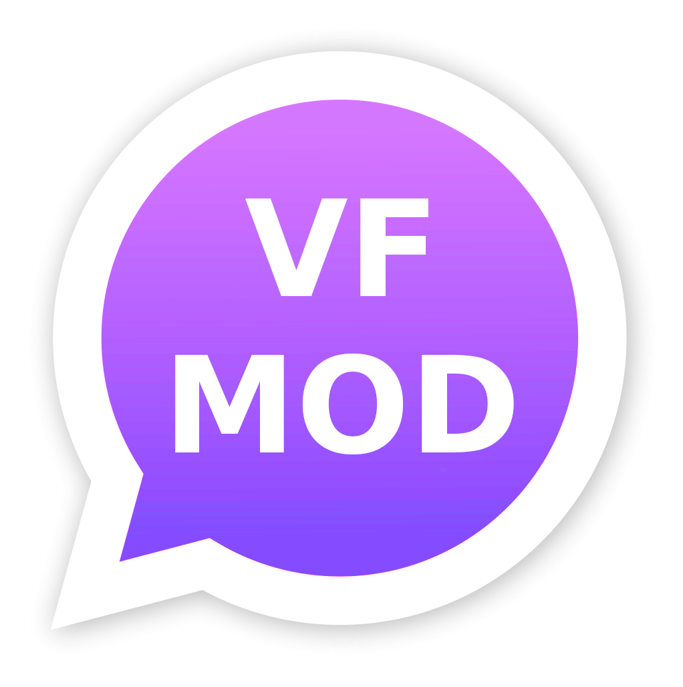

<h1 align="center">
  Whatsapp Web Mod 
</h1>

  An extension to apply mods on Whatsapp Web

  
  

## Summary

- [Features](#features)
- [Default theme](#default-theme)
- [Themes and theme configuration](#themes-and-theme-configuration)
- [300+ gradients available for the background](#300-gradients-available-for-the-background)
- [Themes and theme configuration](#themes-and-theme-configuration)
- [**How to install**](#how-to-install)
  - [Chrome](#chrome)
  - [Firefox](#firefox)

## Features

- Themer (customization)
  - Use or create your own theme!

## Default theme

## Themes and theme configuration

## 300+ gradients available for the background

## How to install

### **Chrome**

- Download the latest [vf-wpp-mod.chrome.zip](https://github.com/vanflux/whatsapp-web-mod/releases)
- Unzip to some location on your PC
- Go to url chrome://extensions
- Enable development mode
- Load the uncompressed extension and pick the unzipped directory
- Go to [Whatsapp Web](https://web.whatsapp.com/) and click on the mod button to toggle configurations:
- 

### **Firefox**

- Download the latest [vf-wpp-mod.firefox.zip](https://github.com/vanflux/whatsapp-web-mod/releases)
- Go to url about:debugging
- Go to This Firefox
- Load temporary add-ons and pick the .zip
- Go to [Whatsapp Web](https://web.whatsapp.com/) and click on the mod button to toggle configurations:
- 
